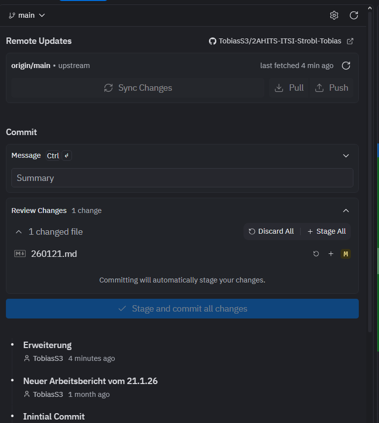

# Arbeitsbericht vom 01.10.25

- Name: Tobias Strobl
- Klasse: 2AHITS
- Gruppe 2
- ITSI Übungen
- Thema: GIT-HUB

## GitHub Anmeldung & Verknüpfung

1. Einen Account bei GitHub erstellen.  
2. Zurück zu Replit wechseln.  
3. Einen neuen Tab öffnen und **Git** auswählen.  
4. Oben rechts auf das **Zahnrad** klicken und die **Einstellungen** öffnen.  
5. Mit dem erstellten GitHub-Account anmelden.  
6. Den Repository-Link bei **Remote** einfügen (Verbindung über **HTTPS**).  
7. Eine **Commit-Message** als Summary eingeben und auf **Commit** klicken.  
8. Anschließend **Sync Changes** auswählen.
 
9. Auf GitHub unter **Actions** überprüfen, ob die Änderungen übernommen wurden.  
10. Den fertigen Bericht als Link über Teams abgeben.
